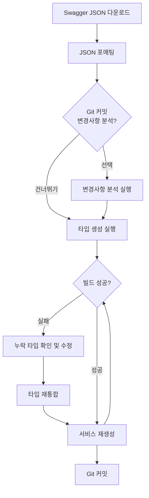

# API 자동 생성 가이드

## 📋 목차

- [개요](#개요)
- [필수 요구사항](#필수-요구사항)
- [Swagger 문서](#swagger-문서)
- [아키텍처](#아키텍처)
- [설정 파일](#설정-파일)
- [자동 생성 프로세스](#자동-생성-프로세스)
- [사용 가이드](#사용-가이드)
- [마이그레이션 전략](#마이그레이션-전략)
- [Swagger 업데이트 워크플로우](#swagger-업데이트-워크플로우)
- [문제 해결 가이드](#문제-해결-가이드)
- [FAQ](#faq)

---

## 개요

이 프로젝트는 OpenAPI Generator를 활용하여 Swagger JSON으로부터 TypeScript 타입과 서비스 클래스를 자동 생성합니다.

### 주요 특징

- ✅ **타입 안정성**: Swagger 스펙으로부터 정확한 TypeScript 타입 자동 생성
- ✅ **일관성**: 도메인별로 타입과 서비스를 체계적으로 구성
- ✅ **유지보수성**: API 스펙 변경 시 자동 업데이트
- ✅ **하위 호환성**: 기존 수동 작성 서비스와 병행 사용 가능

---

## 필수 요구사항

### Java 17+ 설치

OpenAPI Generator는 Java로 작성되어 있어 **Java Runtime Environment (JRE) 또는 Java Development Kit (JDK) 17 이상이 필수**입니다.

> **참고**: 자동 생성된 타입과 서비스는 이미 Git에 포함되어 있으므로, **API 스펙 변경 작업을 하지 않는 일반 개발자는 Java 설치가 필요하지 않습니다**. ✅

#### macOS

**방법 1: Homebrew 사용 (권장)**

```bash
# OpenJDK 17 설치
brew install openjdk@17

# PATH에 추가 (zsh 사용자)
echo 'export PATH="/opt/homebrew/opt/openjdk@17/bin:$PATH"' >> ~/.zshrc
source ~/.zshrc

# bash 사용자
echo 'export PATH="/opt/homebrew/opt/openjdk@17/bin:$PATH"' >> ~/.bash_profile
source ~/.bash_profile

# 설치 확인
java --version
```

**방법 2: 공식 다운로드**

1. [Oracle JDK 다운로드](https://www.oracle.com/java/technologies/downloads/#java17)
2. 또는 [OpenJDK 다운로드](https://adoptium.net/)
3. 설치 후 자동으로 PATH에 등록됨

#### Windows

**방법 1: Chocolatey 사용**

```powershell
# PowerShell (관리자 권한)
choco install openjdk17

# 설치 확인
java --version
```

**방법 2: 공식 다운로드**

1. [Oracle JDK 다운로드](https://www.oracle.com/java/technologies/downloads/#java17)
2. 설치 프로그램 실행
3. 자동으로 PATH 설정됨

#### Linux (Ubuntu/Debian)

```bash
# OpenJDK 17 설치
sudo apt update
sudo apt install openjdk-17-jdk

# 설치 확인
java --version
```

#### 설치 확인

```bash
# Java 버전 확인
java --version

# 출력 예시:
# openjdk 17.0.16 2025-07-15
# OpenJDK Runtime Environment Homebrew (build 17.0.16+0)
# OpenJDK 64-Bit Server VM Homebrew (build 17.0.16+0, mixed mode, sharing)
```

### Node.js 및 pnpm

```bash
# Node.js 20+
node --version  # v20.0.0 이상

# pnpm 8+
pnpm --version  # 8.0.0 이상
```

프로젝트 루트의 [README.md](../README.md)를 참고하여 설치하세요.

---

## Swagger 문서

### API 문서 접근

- **API Docs (JSON)**: http://172.25.1.24:8080/main/v1/v3/api-docs
- **Swagger UI**: http://172.25.1.24:8080/main/v1/swagger-ui/swagger-ui/index.html#/

### Swagger JSON 다운로드

```bash
# API Docs JSON 다운로드
curl http://172.25.1.24:8080/main/v1/v3/api-docs > swagger.json

# JSON 포매팅 (Git diff 가독성 향상)
npx prettier --write swagger.json
```

> **💡 Tip**: 포매팅은 Git diff를 명확하게 만들어 변경사항 추적을 용이하게 합니다.

---

## 아키텍처

### 디렉토리 구조

```
packages/api/src/
├── __generated__/                # OpenAPI Generator 원본 출력 (중간 산물)
│   └── models/                   # 개별 타입 파일들
├── generated-types/              # 통합된 타입 파일들 (사용)
│   ├── api-base.types.ts        # 공통 API 응답 타입
│   ├── auth.types.ts            # 인증 관련 타입
│   ├── member.types.ts          # 회원 관련 타입
│   ├── account.types.ts         # 계좌 관련 타입
│   ├── stock.types.ts           # 주식 관련 타입
│   ├── trade.types.ts           # 거래 관련 타입
│   ├── asset.types.ts           # 자산 관련 타입
│   ├── watch-list.types.ts      # 관심종목 관련 타입
│   ├── terms.types.ts           # 약관 관련 타입
│   ├── common.types.ts          # 공통 타입
│   └── index.ts                 # 전체 export
├── services/                     # 수동 작성 서비스 (기존)
│   ├── user.service.ts          # 사용자 서비스 (유지)
│   ├── auth.service.ts          # 인증 서비스 (유지)
│   └── generated/               # 자동 생성 서비스 (신규)
│       ├── auth.service.ts      # 인증 서비스 (생성)
│       ├── member.service.ts    # 회원 서비스 (생성)
│       ├── account.service.ts   # 계좌 서비스 (생성)
│       ├── stock.service.ts     # 주식 서비스 (생성)
│       ├── trade.service.ts     # 거래 서비스 (생성)
│       ├── asset.service.ts     # 자산 서비스 (생성)
│       ├── watchlist.service.ts # 관심종목 서비스 (생성)
│       ├── terms.service.ts     # 약관 서비스 (생성)
│       └── index.ts             # 전체 export
└── types/                        # 수동 작성 타입 (기존)
    ├── api.types.ts
    └── user.types.ts
```

### 데이터 흐름

```
Swagger JSON
    ↓
OpenAPI Generator (typescript-axios)
    ↓
packages/api/src/__generated__/models/ (개별 타입 파일 - 중간 산물)
    ↓
consolidate-generated-types.ts 스크립트
    ↓
packages/api/src/generated-types/ (도메인별 통합 타입)
    ↓
generate-services.ts 스크립트
    ↓
packages/api/src/services/generated/ (서비스 클래스)
```

---

## 설정 파일

### 1. openapi-generator-config.yaml

OpenAPI Generator의 기본 설정 파일입니다.

```yaml
# 생성 옵션
npmName: '@template/api'
npmVersion: '1.0.0'
supportsES6: true
withInterfaces: true
useSingleRequestParameter: false

# TypeScript 옵션
modelPropertyNaming: 'original'
paramNaming: 'camelCase'
enumPropertyNaming: 'original'

# 템플릿 디렉토리
templateDir: 'openapi-templates/typescript-axios'
```

### 2. 커스텀 템플릿

`openapi-templates/typescript-axios/` 디렉토리에 커스텀 Mustache 템플릿이 있습니다.

주요 수정 사항:
- **modelGeneric.mustache**: enum을 type union으로 변환
- **model.mustache**: 타입 정의 방식 수정

### 3. 도메인 매핑 (consolidate-generated-types.ts)

```typescript
const domainMapping: Record<string, string[]> = {
  'auth.types.ts': [
    'auth-login-request',
    'auth-login-response',
    'auth-refresh-token-request',
    // ...
  ],
  'member.types.ts': [
    'member-approve-request',
    'member-join-response',
    // ...
  ],
  // ... 기타 도메인
};
```

---

## 자동 생성 프로세스

### 빠른 시작

API 타입과 서비스를 생성하는 기본 워크플로우입니다.

```bash
# 1단계: Swagger JSON 다운로드
curl http://172.25.1.24:8080/main/v1/v3/api-docs > swagger.json

# 2단계: JSON 포매팅
npx prettier --write swagger.json

# 3단계: API 클라이언트 및 타입 생성 (OpenAPI Generator + 통합)
pnpm run generate:api

# 4단계: 서비스 클래스 생성
pnpm run generate:services
```

### 프로세스 개요

```
Swagger JSON 다운로드
    ↓
JSON 포매팅
    ↓
OpenAPI Generator 실행 → 개별 타입 파일 생성
    ↓
타입 통합 스크립트 → 도메인별 통합 타입 생성
    ↓
서비스 생성 스크립트 → 서비스 클래스 생성
```

**자세한 절차와 문제 해결 방법은 [Swagger 업데이트 워크플로우](#swagger-업데이트-워크플로우) 섹션을 참고하세요.**

---

## 사용 가이드

### 기존 서비스 (계속 사용)

기존에 작성된 서비스들은 **그대로 유지**하고 계속 사용합니다.

```typescript
// packages/api/src/services/user.service.ts (기존)
import { userService } from '@template/api';

// 기존 방식대로 계속 사용
const user = await userService.getUser(userId);
```

### 신규 서비스 (자동 생성 사용)

**새로 추가하는 기능부터는 자동 생성된 서비스를 사용합니다.**

#### 1. 타입 Import

```typescript
import {
  AuthLoginRequest,
  AuthLoginResponse,
  ResponseDataAuthLoginResponse,
  MemberApproveRequest,
  MemberApproveRequestMemberType,
} from '@template/api/generated-types';
```

#### 2. 서비스 사용

```typescript
// packages/api/src/services/generated/auth.service.ts 사용
import { AuthService } from '@template/api/services/generated';
import { axiosInstance } from '@template/api/axios';

const authService = new AuthService(axiosInstance);

// 로그인
const response = await authService.loginForWeb({
  email: 'test@example.com',
  password: 'password123',
});

// 응답 타입은 자동으로 추론됨
const loginData = response.data; // ResponseDataAuthLoginResponse 타입
```

#### 3. Vue 컴포넌트에서 사용

```vue
<script setup lang="ts">
import { ref } from 'vue';
import { AuthService } from '@template/api/services/generated';
import { AuthLoginRequest, ResponseDataAuthLoginResponse } from '@template/api/generated-types';
import { axiosInstance } from '@template/api/axios';

const authService = new AuthService(axiosInstance);

const loginForm = ref<AuthLoginRequest>({
  email: '',
  password: '',
});

const handleLogin = async () => {
  try {
    const response = await authService.loginForWeb(loginForm.value);
    
    if (response.data.data) {
      const { memberId, memberType, accountInfo } = response.data.data;
      console.log('로그인 성공:', memberId, memberType);
    }
  } catch (error) {
    console.error('로그인 실패:', error);
  }
};
</script>
```

### API 응답 타입 패턴

모든 API 응답은 `ApiSuccessResponse<T>` 패턴을 따릅니다.

```typescript
// api-base.types.ts
export interface ApiSuccessResponse<T> {
  status: string;
  code: number;
  data?: T;  // 옵셔널 (일부 API는 data 없음)
}

// 사용 예시
type LoginResponse = ApiSuccessResponse<AuthLoginResponse>;

// 실제 응답 구조
{
  status: "SUCCESS",
  code: 200,
  data: {
    memberId: 123,
    memberType: "INDIVIDUAL",
    // ...
  }
}
```

---

## 마이그레이션 전략

### 단계별 전환 계획

#### Phase 1: 병행 사용 (현재)

- ✅ 기존 서비스: 그대로 유지하고 계속 사용
- ✅ 신규 기능: 자동 생성된 서비스 사용
- 📝 점진적으로 자동 생성 서비스에 익숙해지기

#### Phase 2: 선택적 마이그레이션

- 🔄 복잡한 비즈니스 로직이 없는 간단한 서비스부터 전환
- 🔄 자동 생성 서비스를 래핑하여 기존 인터페이스 유지
- 📝 팀 내 합의 후 진행

#### Phase 3: 완전 전환 (장기)

- 🎯 모든 신규 API는 자동 생성 사용
- 🎯 기존 서비스는 필요시에만 유지
- 🎯 레거시 제거 계획 수립

### 마이그레이션 예시

기존 수동 작성 서비스를 래핑하는 방법:

```typescript
// services/auth.service.ts (기존 - 래퍼로 변경)
import { AuthService as GeneratedAuthService } from './generated';
import { axiosInstance } from '../axios';

export class AuthService {
  private generatedService: GeneratedAuthService;

  constructor() {
    this.generatedService = new GeneratedAuthService(axiosInstance);
  }

  // 기존 메서드명 유지하면서 내부적으로 generated 사용
  async login(email: string, password: string) {
    const response = await this.generatedService.loginForWeb({
      email,
      password,
    });
    
    // 필요시 추가 로직 처리
    return response.data;
  }

  // 복잡한 비즈니스 로직이 있는 메서드는 그대로 유지
  async loginWithOAuth() {
    // 커스텀 로직...
  }
}

export const authService = new AuthService();
```

---

## Swagger 업데이트 워크플로우

Swagger 스펙이 변경되었을 때 타입과 서비스를 업데이트하는 상세 절차입니다.

### 전체 워크플로우



### 단계별 상세 절차

#### 1단계: Swagger JSON 다운로드 및 포매팅

```bash
# API Docs JSON 다운로드
curl http://172.25.1.24:8080/main/v1/v3/api-docs > swagger.json

# JSON 포매팅 (Git diff 가독성 향상)
npx prettier --write swagger.json
```

#### 2단계: (선택) 변경사항 분석

변경사항을 확인하려면 먼저 Git에 커밋한 후 실행하세요.

```bash
# Git에 커밋
git add swagger.json
git commit -m "chore(api): update swagger.json"

# 변경사항 분석 (날짜별 파일로 저장)
pnpm run analyze:swagger HEAD~1 HEAD swagger-changes-$(date +%Y-%m-%d).md
```

**💡 Tip**: 날짜별 파일명을 사용하면 변경사항 히스토리를 관리하기 쉽습니다.
- 예시: `swagger-changes-2025-10-31.md`
- 기존 파일을 덮어쓰지 않고 새 파일로 저장됩니다.

**분석 결과에는 다음이 포함됩니다:**
- ➕ 추가된 API
- ➖ 제거된 API
- 🔄 변경된 API (path, method, parameters 등)
- 🏷️ 태그 변경사항
- 📋 스키마(타입) 변경사항

#### 3단계: 타입 및 서비스 생성

```bash
# 타입 생성 (OpenAPI Generator + 통합)
pnpm run generate:api

# 서비스 클래스 생성
pnpm run generate:services
```

#### 4단계: 빌드 테스트

```bash
cd packages/api && pnpm run build
```

#### 5단계: 문제 발생 시 해결

**빌드 오류가 발생한 경우:**

1. **누락된 타입 확인**
   - 빌드 오류 메시지에서 누락된 타입 확인
   - `scripts/consolidate-generated-types.ts`의 `domainMapping` 확인

2. **누락 타입 추가**
   ```typescript
   // scripts/consolidate-generated-types.ts
   const domainMapping: Record<string, string[]> = {
     'member.types.ts': [
       // 기존 타입들...
       'member-send-sms-code-request',        // 새로 추가
       'member-verify-sms-code-request',      // 새로 추가
       'response-data-member-sms-response',   // 새로 추가
     ],
     // 새로운 도메인이면 새 섹션 추가
     'new-domain.types.ts': [
       'new-api-request',
       'new-api-response',
     ],
   };
   ```

3. **타입 재통합 및 서비스 재생성**
   ```bash
   pnpm exec tsx scripts/consolidate-generated-types.ts
   pnpm run generate:services
   ```

4. **빌드 재시도**
   ```bash
   cd packages/api && pnpm run build
   ```

#### 6단계: Git 커밋

```bash
# 생성된 타입과 서비스 커밋
git add packages/api/src/generated-types/ packages/api/src/services/generated/
git commit --amend --no-edit  # 이전 커밋에 병합
# 또는
git commit -m "chore(api): generate types and services"
```

### ⚠️ 새로운 API 추가 시 주의사항

**새로운 API가 추가된 경우 반드시 `consolidate-generated-types.ts`를 수정해야 합니다.**

1. Swagger JSON에 새로운 타입이 추가되었는지 확인
2. `domainMapping`에 해당 타입 추가 (또는 새 도메인 섹션 생성)
3. 의존성 타입도 함께 추가 (예: Request, Response 모두 포함)
4. 빌드 성공할 때까지 반복

**예시: 새로운 API 타입 추가**
```typescript
// scripts/consolidate-generated-types.ts
const domainMapping: Record<string, string[]> = {
  'member.types.ts': [
    // 기존 타입들...
    'member-send-sms-code-request',        // 새로 추가
    'member-verify-sms-code-request',      // 새로 추가
    'response-data-member-sms-response',   // 새로 추가
  ],
  // 새로운 도메인이면 새 섹션 추가
  'new-domain.types.ts': [
    'new-api-request',
    'new-api-response',
  ],
};
```

**문제가 발생하면 [문제 해결 가이드](#문제-해결-가이드) 섹션을 참고하세요.**

---

## 문제 해결 가이드

자주 발생하는 문제와 해결 방법입니다.

### 1. 새로운 API가 서비스에 나타나지 않는 경우

**증상:**
- Swagger에 API가 정의되어 있지만 생성된 서비스에서 찾을 수 없음

**원인:**
1. API의 `tags` 필드가 잘못 설정됨
2. 타입이 `consolidate-generated-types.ts`에 누락됨

**해결 방법:**

1. **Swagger JSON에서 API 확인**
   ```bash
   # 특정 API 검색
   grep -n "operationId" swagger.json | grep "your-api-name"
   ```

2. **API 태그 확인**
   - Swagger UI에서 API의 `tags` 필드 확인
   - 태그에 따라 서비스가 그룹화됨
   - 태그가 없거나 잘못된 경우 Swagger 스펙 수정 필요

3. **타입 매핑 확인**
   ```typescript
   // domainMapping에서 해당 타입이 있는지 확인
   const domainMapping = {
     'your-domain.types.ts': [
       'your-api-request',     // ← 이게 있는지 확인
       'your-api-response',    // ← 이게 있는지 확인
     ],
   };
   ```

4. **서비스 생성 로그 확인**
   ```bash
   pnpm run generate:services
   # 로그에서 해당 API가 처리되었는지 확인
   ```

### 2. 타입이 생성되지 않는 경우

**증상:**
- 빌드 오류: `Cannot find name 'SomeType'`

**원인:**
- `consolidate-generated-types.ts`의 `domainMapping`에 타입이 누락됨

**해결 방법:**

1. **누락된 타입 확인**
   ```bash
   cd packages/api && pnpm run build
   # 빌드 오류에서 누락된 타입 확인
   ```

2. **타입 추가**
   - `scripts/consolidate-generated-types.ts`의 `domainMapping`에 추가
   - 적절한 도메인 섹션에 추가하거나 새 도메인 생성

3. **타입 재통합**
   ```bash
   pnpm exec tsx scripts/consolidate-generated-types.ts
   ```

### 3. 빌드 오류: 의존성 타입 누락

**증상:**
- 타입 A를 추가했지만 타입 B에서 참조하는 타입 C가 없어 오류 발생

**원인:**
- 복합 타입의 의존성 타입이 누락됨

**해결 방법:**

1. **의존성 타입 확인**
   - Swagger JSON에서 해당 타입의 모든 의존성 확인
   - Request 타입뿐만 아니라 Response 타입도 확인

2. **모든 의존성 타입 추가**
   ```typescript
   // 예: TradeOrderRequest가 TradeOrderItem[]를 포함하는 경우
   const domainMapping = {
     'trade.types.ts': [
       'trade-order-request',      // ← 메인 타입
       'trade-order-item',         // ← 의존성 타입도 추가
       'trade-order-response',     // ← Response도 추가
     ],
   };
   ```

### 4. 빌드 오류: 중복 타입 선언

**증상:**
- `Duplicate identifier 'SomeType'` 오류

**원인:**
- 같은 타입이 여러 도메인 파일에 중복으로 추가됨

**해결 방법:**

1. **중복 확인**
   - `domainMapping` 전체를 검색하여 중복 타입 찾기

2. **중복 제거**
   - 가장 적절한 도메인에만 유지
   - 나머지 참조 제거

### 5. 서비스 메서드 타입 오류

**증상:**
- 서비스 메서드의 매개변수 또는 반환 타입이 잘못됨

**원인:**
- Swagger 스펙의 타입 정의 문제 또는 `domainMapping` 오류

**해결 방법:**

1. **Swagger 스펙 확인**
   - 해당 API의 request/response 스키마 확인
   - `$ref` 참조가 올바른지 확인

2. **타입 재생성**
   ```bash
   # 타입 재통합
   pnpm exec tsx scripts/consolidate-generated-types.ts
   
   # 서비스 재생성
   pnpm run generate:services
   ```

---

## FAQ

### Q1. 기존 서비스를 언제 자동 생성으로 바꿔야 하나요?

**A:** 당장 바꿀 필요는 없습니다. 기존 서비스는 계속 사용하시고, **새로 추가하는 API부터** 자동 생성된 서비스를 사용하세요.

### Q2. Swagger가 업데이트되면 어떻게 하나요?

**A:** [Swagger 업데이트 워크플로우](#swagger-업데이트-워크플로우) 섹션을 참고하세요.

상세한 단계별 절차와 워크플로우 다이어그램이 포함되어 있습니다.

### Q3. 자동 생성된 서비스를 커스터마이징할 수 있나요?

**A:** 자동 생성 파일은 직접 수정하지 마세요. 대신 래퍼 클래스를 만들어 사용하세요.

```typescript
// services/custom-auth.service.ts
import { AuthService } from './generated';

export class CustomAuthService extends AuthService {
  // 추가 메서드나 로직
  async loginWithCustomLogic() {
    // ...
  }
}
```

### Q4. 타입이 중복으로 생성되는 것 같아요 (예: *TypeType)

**A:** `consolidate-generated-types.ts` 스크립트가 자동으로 `*TypeType` → `*Type`으로 변환합니다.

예시:
- 생성: `MemberApproveRequestMemberTypeType`
- 변환: `MemberApproveRequestMemberType` ✅

### Q5. API URL prefix를 변경하고 싶어요

**A:** `scripts/generate-services.ts` 파일의 `API_PREFIX` 상수를 수정하세요.

```typescript
// scripts/generate-services.ts
const API_PREFIX = '/main/v1';  // 여기를 수정
```

### Q6. 특정 도메인의 타입만 재생성할 수 있나요?

**A:** 현재는 전체 재생성만 지원합니다. 부분 생성이 필요하면 스크립트를 수정해야 합니다.

### Q7. 새로운 API가 추가되었는데 서비스에 나타나지 않아요

**A:** [문제 해결 가이드 - 새로운 API가 서비스에 나타나지 않는 경우](#1-새로운-api가-서비스에-나타나지-않는-경우) 섹션을 참고하세요.

### Q8. API 변경사항을 어떻게 추적하나요?

**A:** [Swagger 업데이트 워크플로우 - 2단계: 변경사항 분석](#2단계-선택-변경사항-분석) 섹션을 참고하세요.

`pnpm run analyze:swagger` 명령어를 사용하여 Git 커밋 간 변경사항을 분석할 수 있습니다.

**날짜별 히스토리 관리 예시:**
```bash
# 날짜별 파일로 저장 (권장)
pnpm run analyze:swagger HEAD~1 HEAD swagger-changes-$(date +%Y-%m-%d).md

# 결과: swagger-changes-2025-10-31.md
```

### Q9. 생성된 서비스에 인터셉터를 어떻게 추가하나요?

**A:** 서비스 생성 시 전달하는 `axiosInstance`에 인터셉터를 설정하세요.

```typescript
import axios from 'axios';

const axiosInstance = axios.create({
  baseURL: 'http://api.example.com',
});

// 인터셉터 추가
axiosInstance.interceptors.request.use((config) => {
  // 토큰 추가 등
  return config;
});

// 서비스 생성
const authService = new AuthService(axiosInstance);
```

---

## 추가 리소스

- [OpenAPI Generator 공식 문서](https://openapi-generator.tech/)
- [TypeScript Axios Generator](https://openapi-generator.tech/docs/generators/typescript-axios/)
- [프로젝트 아키텍처 문서](./architecture.md)
- [패키지 관리 가이드](./package-management.md)

---

## 변경 이력

### 2025-10-31 (오늘)
- ✅ **변경사항 히스토리 관리 개선**
  - 날짜별 파일명 규칙 추가: `swagger-changes-YYYY-MM-DD.md`
  - 기존 파일 덮어쓰기 대신 새 파일로 저장하여 히스토리 유지
  - `$(date +%Y-%m-%d)` 사용 예시 추가

- ✅ **문서 구조 개선 및 중복 제거**
  - "Swagger 업데이트 워크플로우" 신규 섹션 추가 (상세 절차 통합)
  - "문제 해결 가이드" 섹션 확장 (5가지 주요 문제 해결 방법)
  - FAQ 간소화 (중복 제거, 상세 섹션 참조로 변경)
  - "Swagger UI 업데이트 시 주의사항" 삭제 (워크플로우 및 문제 해결 가이드로 통합)
  - 워크플로우 다이어그램 추가
  - 자동 생성 프로세스 섹션 간소화

- ✅ **Swagger JSON 포매팅 단계 추가**
  - 모든 swagger.json 다운로드 단계에 `npx prettier --write swagger.json` 추가
  - Git diff 가독성 향상 및 변경사항 추적 개선
  - 일관된 포매팅으로 팀 협업 효율성 증대

### 2025-01-27
- ✅ **일관성 보장을 위한 개선**
  - `generate-api.js`: 매번 `__generated__/` 디렉토리를 완전히 삭제 후 재생성
  - **해결**: 팀원마다 다른 타입이 생성되는 문제 방지 (항상 깨끗한 상태에서 생성)
- ✅ **누락된 타입 자동 감지 기능 추가**
  - `consolidate-generated-types.ts`에 `checkMissingTypes()` 함수 추가
  - 생성된 타입 중 `domainMapping`에 없는 타입을 자동으로 감지 및 경고
  - 도메인별로 그룹화하여 어디에 추가해야 할지 가이드 제공
  - `index.ts` 파일 자동 필터링
- ✅ **Query Parameter 타입 개선**
  - `generate-services.ts`: Query parameter 타입 생성 로직 개선
  - 단일 $ref 타입: 바로 사용 (예: `request: TradeHistoryRequest`)
  - 단일 primitive 타입: 바로 사용 (예: `request: string`)
  - 다중 primitive 타입: 인라인 객체 (예: `request: { interval?: string; offset?: string; limit?: number }`)
  - `integer` → `number` 자동 변환
  - **해결**: 중복 필드 및 타입 불일치 문제 해결
- ✅ **domainMapping 정리**
  - 백엔드에서 제거된 deprecated 타입 6개 제거
  - `liquidation-*`, `symbol-meta-data`, `order-liquidation-*` 등

### 2024-12-19
- ✅ Swagger UI 업데이트 시 `consolidate-generated-types.ts` 수정 가이드 추가
- ✅ 새로운 API 추가 시 체크리스트 및 문제 해결 가이드 추가
- ✅ 누락된 타입들 (`trade-un-execution-*`, `order-*`, `close-out-*` 등) 추가
- ✅ 타입 통합 개선: 115개 타입 성공적으로 통합

### 2024-10-10
- ✅ 자동 생성 시스템 구축 완료
- ✅ API URL prefix `/main/v1/` 자동 추가
- ✅ `ApiSuccessResponse` data 옵셔널 처리
- ✅ `*TypeType` 중복 제거 패턴 추가
- ✅ 도메인별 타입 통합 완료
- ✅ 서비스 클래스 자동 생성 완료

---

## 문의 및 지원

문제가 발생하거나 개선 사항이 있으면 팀 채널에 공유해주세요.

