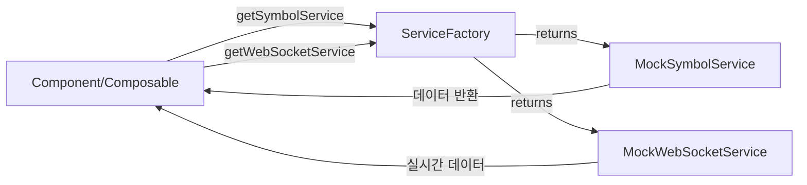
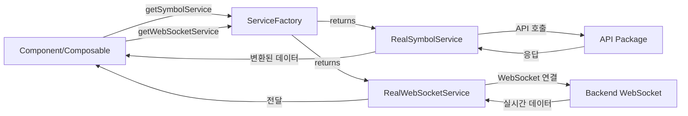

# 서비스 아키텍처 가이드

## 📋 개요

이 문서는 프로젝트의 서비스 레이어 아키텍처를 설명합니다. Mock과 실제 API/WebSocket을 명확하게 분리하고, 환경에 따라 쉽게 전환할 수 있는 구조를 제공합니다.

## 🎯 설계 목표

1. **책임 분리**: Mock 구현과 실제 구현을 명확히 분리
2. **의존성 역전**: 인터페이스에 의존하여 구현 교체 용이
3. **유연한 전환**: 환경 변수로 Mock ↔ 실제 API 전환
4. **타입 안전성**: 모든 서비스가 동일한 인터페이스 보장

## 📦 패키지 구조

### packages/types

공통 타입 및 서비스 인터페이스 정의

```
packages/types/src/
└── services/
    ├── ISymbolService.ts       # 심볼 데이터 조회/관리 인터페이스
    └── IWebSocketService.ts    # 실시간 시세 WebSocket 인터페이스
```

**주요 인터페이스:**

```typescript
// ISymbolService: 심볼 데이터 조회
export interface ISymbolService {
  getAllSymbols(): Promise<TradingSymbol[]>;
  searchSymbols(query: string): Promise<TradingSymbol[]>;
  isValidSymbol(ticker: string): Promise<boolean>;
  getSymbolPrice(ticker: string): Promise<SymbolPrice | null>;
  getSymbolPrices(tickers: string[]): Promise<Map<string, SymbolPrice>>;
}

// IWebSocketService: 실시간 시세 스트리밍
export interface IWebSocketService {
  isConnected(): boolean;
  getConnectionState(): ConnectionState;
  connect(): Promise<void>;
  disconnect(): Promise<void>;
  subscribe(symbol: string, callback: WebSocketCallback): string;
  unsubscribe(subscriptionId: string): void;
  unsubscribeBySymbol(symbol: string, callback?: WebSocketCallback): void;
  unsubscribeAll(): void;
  reconnect(): Promise<void>;
  cleanup(): void;
}
```

### packages/utils

순수 유틸리티 함수 (Mock/실제 환경 무관)

```
packages/utils/src/
└── symbol.ts
    ├── parseFullSymbol()      # 심볼 파싱 ("Bitfinex:BTC/USD" → 객체)
    ├── formatSymbol()         # 심볼 포맷팅
    └── filterSymbols()        # 심볼 필터링
```

**특징:**
- ✅ 순수 함수 (부작용 없음)
- ✅ Mock/실제 환경 모두에서 사용
- ✅ 테스트 용이

### packages/mocks

Mock 구현 (개발/테스트 환경 전용)

```
packages/mocks/src/
├── services/
│   ├── MockSymbolService.ts       # ISymbolService 구현
│   └── MockWebSocketService.ts    # IWebSocketService 구현
├── handlers/                      # MSW 핸들러 (HTTP API 모킹)
├── data/                          # Mock 데이터
└── utils/                         # Mock 데이터 생성 유틸
```

**주요 클래스:**

```typescript
// MockSymbolService: 간단한 테스트 데이터 제공
export class MockSymbolService implements ISymbolService {
  async getAllSymbols(): Promise<TradingSymbol[]> {
    await this.delay(50);  // 네트워크 지연 시뮬레이션
    return [...ALL_SYMBOLS];
  }
  // ... 기타 메서드
}

// MockWebSocketService: 실시간 시세 시뮬레이션
export class MockWebSocketService implements IWebSocketService {
  subscribe(symbol: string, callback: WebSocketCallback): string {
    // Mock 데이터 스트리밍 시작
    this.startPriceUpdates(symbol);
    return subscriptionId;
  }
  // ... 기타 메서드
}
```

### packages/api

실제 백엔드 API 서비스 (OpenAPI Generator 생성)

```
packages/api/src/
└── services/generated/
    ├── StockService.ts
    ├── QuoteService.ts
    ├── AuthService.ts
    └── ...
```

**특징:**
- ✅ OpenAPI 스펙 기반 자동 생성
- ✅ 실제 백엔드 API 구조 반영
- ❌ Mock 서비스와는 다른 인터페이스 (의도된 설계)

## 🏗️ 앱 레벨 구조 (apps/sample-desktop)

### src/services/

비즈니스 로직 레이어

```
src/services/
├── factory/
│   └── ServiceFactory.ts      # Mock/실제 서비스 선택 팩토리
├── api/
│   └── index.ts              # API 서비스 인스턴스 생성
├── localStorage/
│   ├── local-storage.service.ts
│   └── local-storage-key.ts
└── auth.service.ts           # 인증 관련 로직 (TODO: 리팩토링 및 제거 예정)
```

**ServiceFactory 사용법:**

```typescript
import { getSymbolService, getWebSocketService } from '@/services/factory/ServiceFactory';

// 환경에 따라 Mock 또는 실제 구현 자동 선택
const symbolService = getSymbolService();
const symbols = await symbolService.getAllSymbols();

const wsService = getWebSocketService();
await wsService.connect();
const subId = wsService.subscribe('EURUSD', (data) => {
  console.log('실시간 데이터:', data);
});
```

**현재 상태:**
- ✅ Mock 서비스만 제공
- 🔜 실제 API 연동 시 환경 변수로 전환

### src/managers/

상태 및 리소스 생명주기 관리

```
src/managers/
├── ui/
│   └── ChartManager.ts        # 차트 인스턴스 관리
├── toast/
│   └── ToastManager.vue       # 토스트 상태 관리
└── index.ts                   # ManagerFactory (ChartManager만 관리)
```

**Manager vs Service 차이:**

| 구분 | Service | Manager |
|------|---------|---------|
| **목적** | 비즈니스 로직 처리 | 상태/리소스 생명주기 관리 |
| **상태** | 무상태 또는 최소 상태 | 상태 적극 관리 |
| **예시** | API 호출, 데이터 변환 | 차트 생성/삭제, 구독 관리 |
| **메서드** | `login()`, `fetchData()` | `initialize()`, `cleanup()`, `destroy()` |

## 🔄 데이터 흐름

### 개발 환경 (Mock)



### 실제 환경 (추후)



## 📝 사용 가이드

### 1. 새로운 Mock 서비스 사용하기

**기존 방식 (제거 예정):**
```typescript
import { getAllSymbols } from '@template/mocks';

const symbols = getAllSymbols();  // 동기
```

**새로운 방식:**
```typescript
import { getSymbolService } from '@/services/factory/ServiceFactory';

const symbolService = getSymbolService();
const symbols = await symbolService.getAllSymbols();  // 비동기
```

### 2. WebSocket 사용하기

**기존 방식:**
```typescript
// window 전역 객체 사용
(window as any).mockWebSocketManager.subscribe(symbol, callback);
```

**새로운 방식:**
```typescript
import { getWebSocketService } from '@/services/factory/ServiceFactory';

const wsService = getWebSocketService();
await wsService.connect();

const subscriptionId = wsService.subscribe(symbol, (data) => {
  // 실시간 데이터 처리
});

// 구독 해제
wsService.unsubscribe(subscriptionId);
```

### 3. 실제 API 연동하기 (TBD)

**ServiceFactory.ts 수정:**

```typescript
// apps/sample-desktop/src/services/factory/ServiceFactory.ts
static getSymbolService(): ISymbolService {
  if (!this.symbolService) {
    if (import.meta.env.VITE_USE_MOCK === 'false') {
      // 실제 API 래핑 서비스 구현
      this.symbolService = new RealSymbolService();
    } else {
      this.symbolService = mockSymbolService;
    }
  }
  return this.symbolService;
}
```

**환경 변수 설정:**

```bash
# .env.development
VITE_USE_MOCK=true

# .env.production
VITE_USE_MOCK=false
```

## 🔧 구현 세부사항

### ServiceFactory 패턴

**싱글톤 패턴 사용:**
```typescript
export class ServiceFactory {
  private static symbolService: ISymbolService | null = null;
  
  static getSymbolService(): ISymbolService {
    if (!this.symbolService) {
      this.symbolService = mockSymbolService;
    }
    return this.symbolService;
  }
  
  // 테스트용 메서드
  static reset(): void { ... }
  static inject(service: ISymbolService): void { ... }
}
```

**장점:**
- ✅ 전역에서 동일한 서비스 인스턴스 사용
- ✅ 메모리 효율적
- ✅ 테스트 시 쉽게 교체 가능

### Mock 서비스 특징

**네트워크 지연 시뮬레이션:**
```typescript
private delay(ms: number): Promise<void> {
  return new Promise(resolve => setTimeout(resolve, ms));
}

async getAllSymbols(): Promise<TradingSymbol[]> {
  await this.delay(50);  // 실제 API 응답 속도 시뮬레이션
  return [...ALL_SYMBOLS];
}
```

**실시간 데이터 생성:**
```typescript
private generatePriceUpdate(symbol: string): void {
  const volatility = 0.001;
  const change = (Math.random() - 0.5) * 2 * volatility;
  const newPrice = currentPrice * (1 + change);
  
  // 구독자들에게 전송
  this.notifySubscribers(symbol, newPrice);
}
```

## 🚀 마이그레이션 가이드

### 기존 코드 → 새로운 코드

#### 1. 심볼 목록 조회

**Before:**
```typescript
import { getAllSymbols } from '@template/mocks';

const symbols = ref(getAllSymbols());
```

**After:**
```typescript
import { getSymbolService } from '@/services/factory/ServiceFactory';

const symbols = ref<TradingSymbol[]>([]);
const loading = ref(false);

const loadSymbols = async () => {
  loading.value = true;
  try {
    const symbolService = getSymbolService();
    symbols.value = await symbolService.getAllSymbols();
  } finally {
    loading.value = false;
  }
};

onMounted(() => {
  loadSymbols();
});
```

#### 2. WebSocket 구독

**Before:**
```typescript
import { mockWebSocketManager } from '@template/mocks';

const subId = mockWebSocketManager.subscribe(symbol, callback);
mockWebSocketManager.unsubscribe(symbol);
```

**After:**
```typescript
import { getWebSocketService } from '@/services/factory/ServiceFactory';

const wsService = getWebSocketService();
await wsService.connect();

const subId = wsService.subscribe(symbol, callback);
wsService.unsubscribe(subId);

// cleanup 시
wsService.cleanup();
```

#### 3. 순수 유틸리티 함수

**Before:**
```typescript
import { parseFullSymbol } from '@template/mocks';

const parsed = parseFullSymbol("Bitfinex:BTC/USD");
```

**After:**
```typescript
import { parseFullSymbol } from '@template/utils';

const parsed = parseFullSymbol("Bitfinex:BTC/USD");
```

## 🏛️ 앱 레벨 구조 (apps/sample-desktop)

```
src/
├── services/                  # 비즈니스 로직
│   ├── factory/
│   │   └── ServiceFactory.ts  # Mock/실제 서비스 선택 팩토리
│   ├── api/
│   │   └── index.ts          # API 서비스 인스턴스
│   ├── localStorage/
│   │   ├── local-storage.service.ts
│   │   └── local-storage-key.ts
│   └── auth.service.ts       # 인증 로직 (TODO: 리팩토링 예정)
│
├── managers/                  # 상태/리소스 관리
│   ├── ui/
│   │   └── ChartManager.ts        # 차트 인스턴스 관리
│   ├── toast/
│   │   └── ToastManager.vue       # 토스트 상태 관리
│   └── index.ts                   # ManagerFactory
│
└── composables/               # Vue Composition API
    ├── useSymbolData.ts
    ├── useMarketData.ts
    ├── useSymbolSubscriptionManager.ts
    └── useSelectedSymbol.ts
```

### Import 경로 규칙

```typescript
// ✅ 올바른 import
import { getSymbolService, getWebSocketService } from '@/services/factory/ServiceFactory';
import { getChartManager } from '@/managers';
import { parseFullSymbol } from '@template/utils';
import { mockSymbolService, mockWebSocketService } from '@template/mocks';

// ❌ 잘못된 import (더 이상 사용 안 함)
import { getAllSymbols } from '@template/mocks';  // deprecated
import { getDataSourceManager } from '@/managers';  // 제거됨
```

## 🔄 실제 API 연동 준비

### TODO 리스트

**ServiceFactory.ts 내 TODO 주석 참고:**

1. **심볼 목록 조회 API**
   ```typescript
   // TODO: 실제 API 연동 시
   // - @template/api의 StockService.getOrderStocks() 검토
   // - 별도의 심볼 리스트 API가 있다면 해당 API 사용
   // - getOrderStocks()는 복잡한 파라미터 필요 (계좌번호, 페이징 등)
   // - 간단한 심볼 목록 조회 API 추가 검토 필요
   ```

2. **WebSocket 연동**
   ```typescript
   // TODO: 실제 WebSocket 구현 시
   // - 백엔드 WebSocket 엔드포인트 확인
   // - 메시지 포맷 스펙 확인
   // - 재연결 로직 구현
   // - 에러 핸들링 강화
   ```

### 실제 구현 예시 (참고)

```typescript
// apps/sample-desktop/src/services/symbol/RealSymbolService.ts (미래)
import { stockService } from '@/services/api';
import type { ISymbolService, TradingSymbol } from '@template/types';

export class RealSymbolService implements ISymbolService {
  async getAllSymbols(): Promise<TradingSymbol[]> {
    // 실제 API 호출
    const response = await stockService.getOrderStocks(
      JSON.stringify({ stockGroupCd: "ALL", nextKey: "0" })
    );
    
    // 응답 데이터를 TradingSymbol 형식으로 변환
    return this.transformToSymbols(response.data);
  }
  
  private transformToSymbols(data: any): TradingSymbol[] {
    // 변환 로직
  }
}
```

## 🎭 환경별 동작

### 개발 환경 (VITE_USE_MOCK=true)

```
Component → ServiceFactory → MockSymbolService → ALL_SYMBOLS 상수
                           → MockWebSocketService → Mock 데이터 생성
```

### 실제 환경 (VITE_USE_MOCK=false)

```
Component → ServiceFactory → RealSymbolService → StockService → 백엔드 API
                           → RealWebSocketService → 백엔드 WebSocket
```

## ⚠️ 주의사항

### 1. 기존 함수 방식 (호환성 유지)

**현재 mocks 패키지에 남아있는 함수들:**

```typescript
// packages/mocks/src/utils/symbols.ts
export function getAllSymbols(): TradingSymbol[]  // 아직 사용 가능
export function searchSymbols(query: string)
export function isValidSymbol(ticker: string)
export function getSymbolBasePrice(ticker: string)
```

**상태:**
- ✅ 현재는 호환성을 위해 유지
- 🔜 추후 별도 커밋으로 제거 예정
- 💡 새로운 코드는 ServiceFactory 사용 권장

### 2. 비동기 변경

**중요한 변경사항:**

모든 서비스 메서드가 **동기 → 비동기**로 변경되었습니다.

```typescript
// 기존: 동기
const symbols = getAllSymbols();

// 신규: 비동기
const symbols = await symbolService.getAllSymbols();
```

**이유:**
- ✅ 실제 API는 비동기이므로 인터페이스 통일
- ✅ 네트워크 지연 시뮬레이션 가능
- ✅ 향후 확장성 확보

### 3. 전역 객체 사용 제한

**기존 방식 (지양):**
```typescript
(window as any).mockWebSocketManager.subscribe(...)
```

**새로운 방식 (권장):**
```typescript
const wsService = getWebSocketService();
wsService.subscribe(...)
```

## 📚 참고 문서

- [API 생성 가이드](./api-generation-guide.md) - OpenAPI Generator 사용법
- [실시간 데이터 동기화 아키텍처](./realtime-data-sync-architecture.md) - WebSocket 아키텍처 (수정 작성 예정)

## ❓ FAQ

### Q1. Mock과 실제 API 구조가 다른데 문제없나요?

A. **의도된 설계입니다.**
- Mock 서비스: 개발/테스트용 간단한 데이터 제공
- 실제 API: 복잡한 비즈니스 로직 (계좌, 권한, 페이징 등)
- ServiceFactory를 통해 Mock은 `ISymbolService`를, 실제는 API를 래핑하여 동일 인터페이스 제공

### Q2. 왜 packages/services 패키지를 만들지 않았나요?

A. **ServiceFactory는 앱별 설정이기 때문입니다.**
- 앱마다 다른 Mock/실제 전환 전략 가능
- packages는 순수 구현만 포함
- 의존성 흐름이 깔끔함

### Q3. 기존 코드는 언제 제거하나요?

A. **단계적으로 진행합니다.**
- 현재: 호환성 유지 (기존 함수 방식 사용 가능)
- 다음: 모든 사용처를 새 방식으로 변경
- 마지막: 별도 커밋으로 기존 함수 제거

### Q4. Manager와 Service를 어떻게 구분하나요?

A. **질문으로 판단:**
- "이것이 **무엇을 하는가**?" → Service
- "이것이 **무엇을 관리하는가**?" → Manager
- "생명주기가 있는가?" → Manager
- "상태가 없는가?" → Service

## 📊 변경 전후 비교

### Before

```
packages/mocks/          # 모든 것이 섞여 있음
  ├── getAllSymbols()    ← Mock 데이터 + 유틸리티
  ├── parseFullSymbol()  ← 순수 유틸리티
  └── MockWebSocket      ← Mock 구현

apps/sample-desktop/src/
  ├── service/           ← 단수
  └── services/managers/ ← 복수/중첩
```

### After

```
packages/
  ├── types/services/    # 인터페이스
  ├── utils/symbol.ts    # 순수 유틸리티
  └── mocks/services/    # Mock 구현만

apps/sample-desktop/src/
  ├── services/          # 비즈니스 로직
  │   └── factory/       # ServiceFactory
  ├── managers/          # 상태/리소스 관리 (ChartManager만)
  └── composables/       # ServiceFactory 직접 사용
```

## 🧪 테스트

### ServiceFactory 테스트 예시

```typescript
import { ServiceFactory } from '@/services/factory/ServiceFactory';
import { MockSymbolService } from '@template/mocks';

describe('ServiceFactory', () => {
  beforeEach(() => {
    ServiceFactory.reset();
  });

  it('싱글톤 인스턴스 반환', () => {
    const service1 = ServiceFactory.getSymbolService();
    const service2 = ServiceFactory.getSymbolService();
    expect(service1).toBe(service2);
  });

  it('커스텀 서비스 주입', () => {
    const mockService = new MockSymbolService();
    ServiceFactory.inject(mockService);
    
    const service = ServiceFactory.getSymbolService();
    expect(service).toBe(mockService);
  });
});
```

## 💼 실무 팁

### 1. Composable에서 사용

```typescript
export function useSymbolData() {
  const symbols = ref<TradingSymbol[]>([]);
  const loading = ref(false);
  const error = ref<string | null>(null);
  
  const loadSymbols = async () => {
    loading.value = true;
    error.value = null;
    
    try {
      const symbolService = getSymbolService();
      symbols.value = await symbolService.getAllSymbols();
    } catch (e) {
      error.value = e instanceof Error ? e.message : '로드 실패';
    } finally {
      loading.value = false;
    }
  };
  
  onMounted(() => loadSymbols());
  
  return { symbols, loading, error, loadSymbols };
}
```

### 2. 에러 처리

```typescript
const symbolService = getSymbolService();

try {
  const symbols = await symbolService.getAllSymbols();
} catch (error) {
  // Mock 환경에서는 거의 발생하지 않음
  // 실제 환경에서는 네트워크 에러 등 처리
  console.error('심볼 로드 실패:', error);
}
```

### 3. 캐싱 전략

```typescript
// 전역 캐시 (useSelectedSymbol.ts 참고)
const globalSymbolsCache = ref<TradingSymbol[]>([]);

const loadSymbolsCache = async () => {
  if (globalSymbolsCache.value.length === 0) {
    const symbolService = getSymbolService();
    globalSymbolsCache.value = await symbolService.getAllSymbols();
  }
};
```

## 🔗 관련 파일

### 핵심 파일
- `packages/types/src/services/` - 서비스 인터페이스
- `packages/mocks/src/services/` - Mock 구현
- `apps/sample-desktop/src/services/factory/ServiceFactory.ts` - 팩토리

### 주요 사용처
- `apps/sample-desktop/src/composables/useSymbolData.ts`
- `apps/sample-desktop/src/composables/useMarketData.ts`
- `apps/sample-desktop/src/composables/useSelectedSymbol.ts`
- `apps/sample-desktop/src/composables/useSymbolSubscriptionManager.ts`


